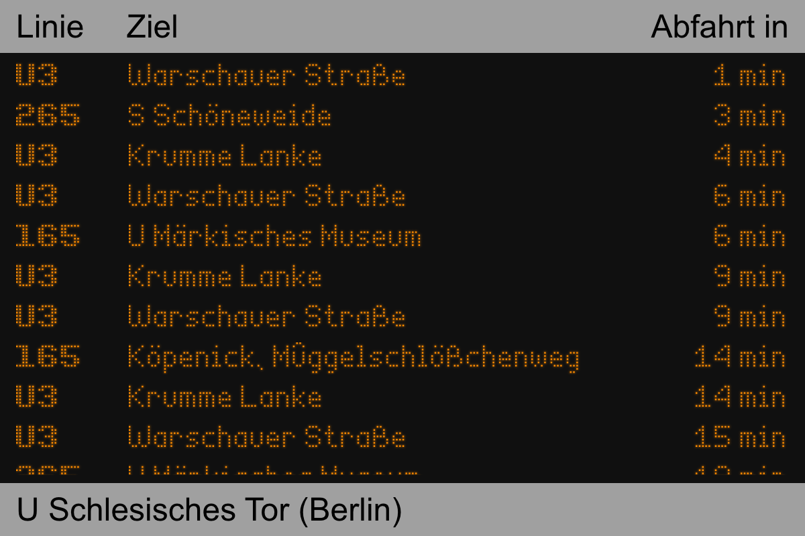

<div align="center">

# 🚌 Berlin Public Transport Display

An authentic, retro amber LED matrix display showing real-time departures for Berlin public transport (BVG/VBB).

[](https://reactjs.org/)
[](https://vite.dev/)
[](https://vitest.dev/)
[](LICENSE)
<p align="center">
  
</p>

</div>


---

## ✨ Features

- 📍 **Smart Proximity Detection**: Uses browser Geolocation to automatically discover the nearest bus, tram, U-Bahn, or S-Bahn station.
- ⏱️ **Real-Time Live Departures**: Streams up-to-date departure schedules directly from the VBB HAFAS API, refreshing every 30 seconds.
- 🎛️ **Manual Coordinate Override**: Easily display any station in Berlin by passing query parameters (`?lat=...&long=...`).
- 🟡 **Retro Dot-Matrix Aesthetic**: Realistic digital transit board styling featuring amber glow, custom dot-matrix digital fonts, and flashing indicators for imminent departures.
- ⚡ **Powered by Vite**: Instant HMR development server and ultra-fast production builds.

---

## 🚀 Quick Start

### Prerequisites

- [Node.js](https://nodejs.org/) (version 18+ recommended)
- `npm` or `yarn` / `pnpm`

### Installation

1. **Clone the repository:**
   ```bash
   git clone https://github.com/nicufarmache/berlin-public-transport-display.git
   cd berlin-public-transport-display
   ```

2. **Install dependencies:**
   ```bash
   npm install
   ```

3. **Start the development server:**
   ```bash
   npm run dev
   ```

4. Open [http://localhost:3000](http://localhost:3000) in your browser.

---

## 🛠️ URL Parameters

You can specify custom coordinates via query parameters in the URL to show departures for any specific location:

| Parameter | Type | Description | Example |
| :--- | :--- | :--- | :--- |
| `lat` | `float` | Latitude of the target location | `52.520008` (Alexanderplatz) |
| `long` | `float` | Longitude of the target location | `13.404954` |

#### Examples:
- **Alexanderplatz**: `http://localhost:3000/?lat=52.520008&long=13.404954`
- **Zoologischer Garten**: `http://localhost:3000/?lat=52.50697&long=13.33286`
- **Kottbusser Tor**: `http://localhost:3000/?lat=52.499044&long=13.41808`

> ℹ️ *If no query parameters are provided, the app will request your current GPS position via browser geolocation. If denied or unavailable, it falls back to a default station.*

---

## 📜 Available Scripts

| Command | Description |
| :--- | :--- |
| `npm run dev` / `npm start` | Starts the Vite local development server with hot-reload on port `3000`. |
| `npm run build` | Compiles and bundles production-ready assets into the `dist/` directory. |
| `npm run preview` | Spins up a local static server to preview the production build. |
| `npm test` | Runs the test suite once with [Vitest](https://vitest.dev/). |
| `npm run test:watch` | Runs tests in interactive watch mode. |

---

## 🏗️ Project Architecture & Tech Stack

```text
berlin-public-transport-display/
├── public/                 # Static assets (favicons, manifests)
├── src/
│   ├── App.jsx             # Main controller: geolocation, polling & timers
│   ├── Board.jsx           # Station board layout & header/footer
│   ├── Line.jsx            # Individual line row with countdown & blink logic
│   ├── App.css / Board.css # Retro amber dot-matrix styling & responsive layout
│   ├── index.jsx           # React DOM root entry point
│   ├── App.test.jsx        # Vitest & Testing Library test suite
│   └── setupTests.js       # Jest-DOM matchers for Vitest
├── index.html              # Vite HTML entry point
├── vite.config.js          # Vite build & test configuration
└── package.json            # Project dependencies and npm scripts
```

- **Frontend Framework**: [React 18](https://reactjs.org/) (Functional Components & Hooks)
- **Bundler & Dev Server**: [Vite](https://vite.dev/)
- **API Client**: [hafas-rest-api-client](https://github.com/derhuerst/hafas-rest-api-client) connecting to VBB HAFAS endpoint
- **Testing**: [Vitest](https://vitest.dev/) + [@testing-library/react](https://testing-library.com/)
- **Fonts**: Custom Dot-Matrix 7-segment digital web fonts (`EnhancedDotDigital-7`, `BoldDotDigital-7`)

---

## 🚢 Deployment

Build the static output:

```bash
npm run build
```

The output in `dist/` is completely static and can be deployed directly to any static host (Vercel, Netlify, Cloudflare Pages, GitHub Pages, AWS S3, or Nginx).

---

## 📄 License

This project is licensed under the [MIT License](LICENSE).


